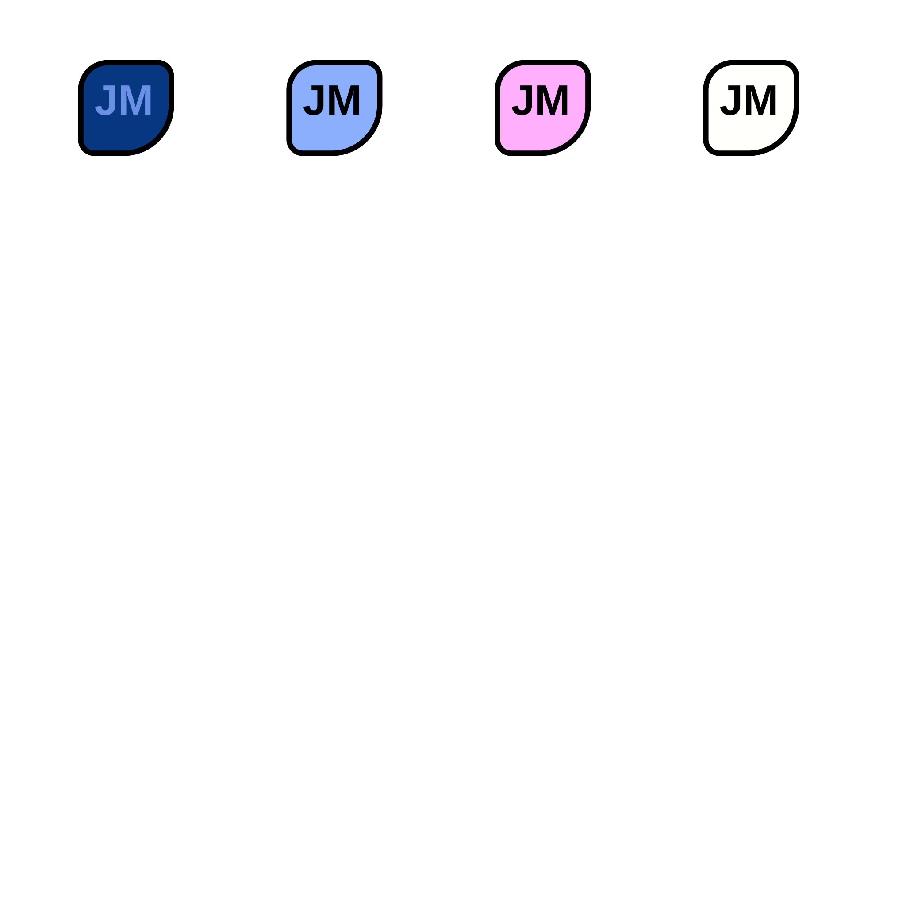

# Joymon

|  | by |  |
|-|-|-|

A simple alternative to system tools for real-time monitoring of controller trigger inputs.

It could used on a second monitor during gaming sessions to monitor faulty triggers.

Made both for GUI fans and Terminal enjoyers.

| GUI | CLI |
|-|-|
|  | 

## Requirements

To run this application you'll need [Python](https://python.org) and [uv](https://docs.astral.sh/uv/)

## Instalation

### 1. Download

You can either

- Download ZIP file: [Downloading source code archives](https://docs.github.com/en/repositories/working-with-files/using-files/downloading-source-code-archives)
- Cloning with `git` (requires [Git](https://git-scm.com/)): [Cloning a repository](https://docs.github.com/en/repositories/creating-and-managing-repositories/cloning-a-repository)

### 2. Setup

Complete these steps after downloading source and requirements.

1. Open the installed directory in terminal
2. Run command `uv sync` to install dependencies

### 3. Usage

When the setup is complete, connect your controller and run `uv run main.py` in the project directory to launch the app.

This app comes with *two* UIs:
- GUI (default)
- CLI

You can choose which one you want to use before launch by adding one of the following arguments:
- `--gui` to explicitly select the GUI (`uv run main.py --gui`)
- `--cli` to select the CLI (`uv run main.py --cli`)
